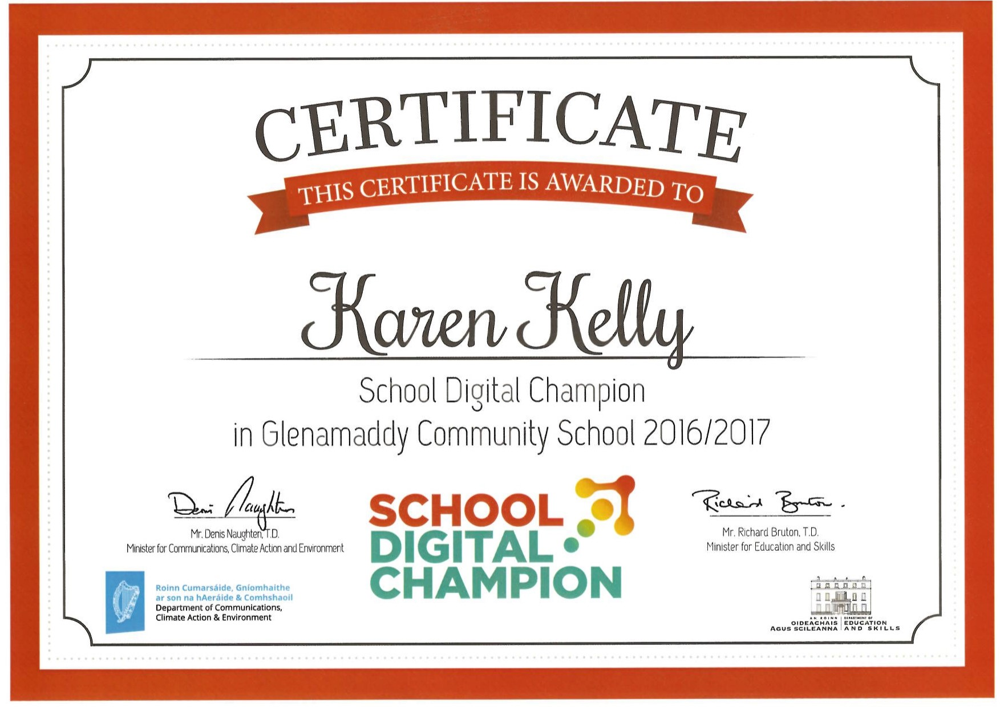

# PhysChem Website
### School's Digital Champion 2016/2017
This project was delevoped primarily as my project as my School's Digital Champion. 
This programme is an initiative that was set up in 2015 by the Department of Communications, Climate Action and Environment.

The project which I worked on is a website for the subject of Physics and Chemistry combined. I decided to do this as my project because there are very limited resources for the subject.

Throughout the duration of the year, I improved my coding and ICT skills by working on my project. As my project progressed, I worked closely with Ms Lyons, part of the IT department in my school, who has helped me with all the stages of the project. I also gained tremendous help and support from my mentors and fellow Ninjas at my local Coder Dojo. I attended a training day in NUI Galway in December 2016. At this training day, myself and digital champions from other schools, took part in workshops on web design and app design. In March, I attended a site visit which took place in RTÉ. Here we received talks on mobile journalism, 360⁰ and VR cameras, participated in Snapchat based workshops and got a tour of the RTÉ studios including the sets of Fair City and The Late Late Show. The final presentation of my project was in DCU. Here I presented my project and was able to talk to Minister Denis Naughten, who not only is the Minister for Communication, Climate Action and the Environment but is also one of my local TDs. I was able to tell him about the impact my website had, particularly on my own PhysChem class.

### Coolest Projects
In June 2017, I presented my project as part of Coolest Projects Awards as part of the websites category, which is run by Coder Dojo. 

## Website
To view this website visit:
https://physicschemistry.github.io/index.html

## Author
- [Karen Kelly](https://github.com/kkelly99)

## Acknowledgements
- Brigid Lyons
- Padraic Wade
- Micheál Wade
